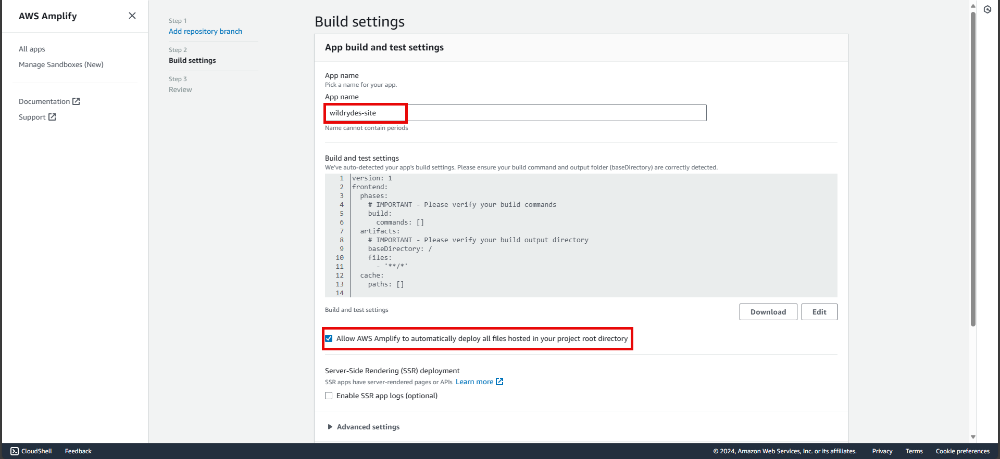
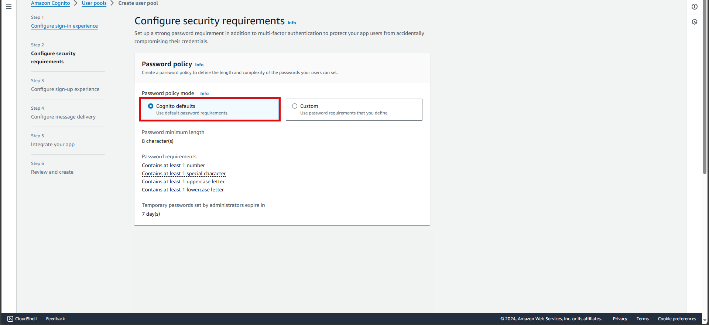
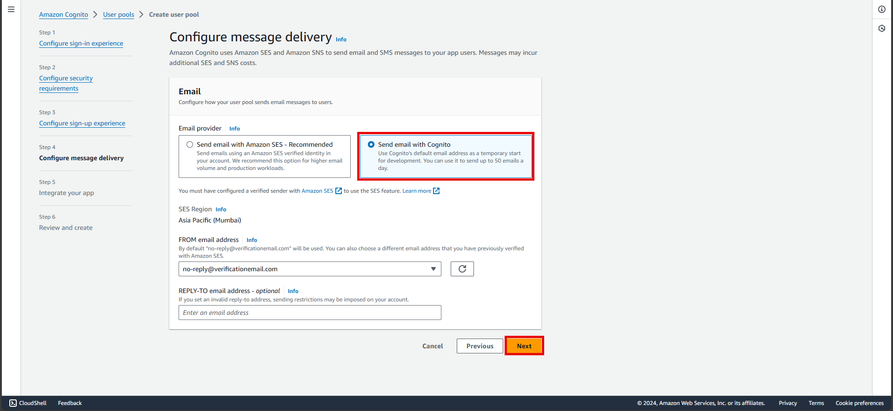
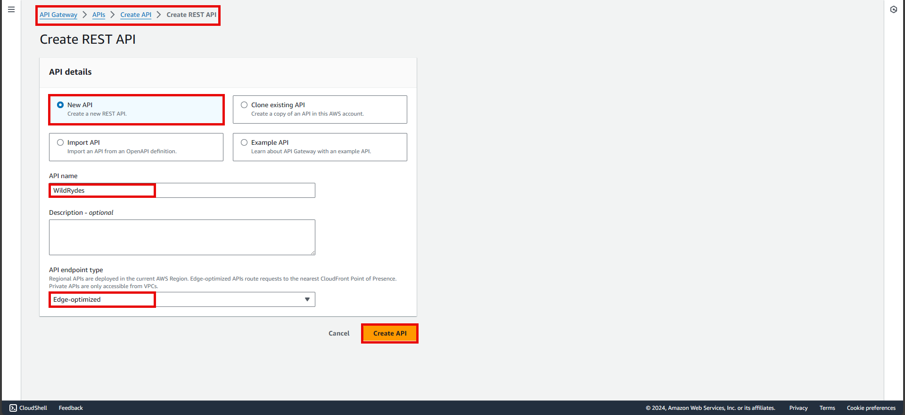
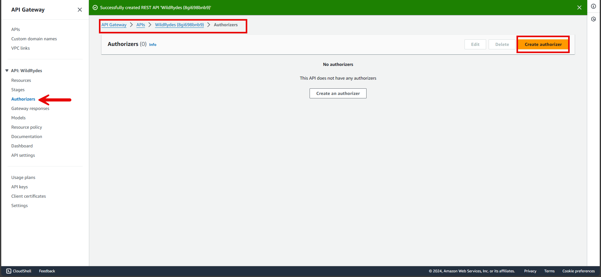

# WildRydes : An End-to-End Serverless Web Application

In this project I will build a ride sharing app (for imaginary unicorns!), with the help of the AWS Wild Rydes sample project.  I’ll use seven different services — CodeCommit, Amplify, Cognito, Lambda, IAM, API Gateway and DynamoDB.  As I go step by step, explained every parts and steps in detail below.

<!-- [Reference](https://aws.amazon.com/getting-started/hands-on/build-serverless-web-app-lambda-apigateway-s3-dynamodb-cognito/) -->

## Application architecture


## Part 1: Setup the CodeCommit repository and project source code


### Step 1: Create an empty repository on CodeCommit

1. Open the **AWS CodeCommit console**.
2. Choose **Create Repository**.


3. Enter **wildrydes-site** for the Repository name.
4. Choose **Create**.


### Step 2: Add a policy to your IAM user, so you can access CodeCommit

1. Go to the **IAM user page** in **AWS root account**.
2. Select **Add permission**.
3. Select **'AWSCodeCommitPowerUser'** permission policy and **Add Permission**.

*This permission policy will allow the IAM user to perform AWS CodeCommit operations.*


### Step 3: Create Git credentials for IAM user to allow HTTPS connections to CodeCommit

Once repository is created and set up an IAM user. Generate the Git credentials in the IAM console.

1. Go to the **IAM user page** in **AWS root account**.
2. Change the tab to **Security credentials**.


3. Scroll below to the part **HTTPS Git credentials for AWS CodeCommit**.
4. Click on **Generate credentials** and download or save these generated credentials.


### Step 4: Clone the repository (create an empty folder for future code)

1. Navigate back to the **AWS CodeCommit console** and select the **wildrydes-site** repository.
2. Select **Clone HTTPS** from the **Clone URL** dropdown to copy the HTTPS URL.
   


3. Open a CloudShell on your selected region (if it supports) run git clone command and paste the HTTPS URL of the repository.

```bash
$ git clone https://git-codecommit.ap-south-1.amazonaws.com/v1/repos/wildrydes-site
Cloning into 'wildrydes-site'...
Username for 'https://git-codecommit.ap-south-1.amazonaws.com': <your username>
Password for 'https://wildryde-project-at-722987121307@git-codecommit.ap-south-1.amazonaws.com': <your password>
warning: You appear to have cloned an empty repository.
```

*There will be a warning that you appear to have cloned an empty repository, this is expected.* 

### Step 5: Copy the project code from the S3 bucket and commit it to new repository

Once the AWS CodeCommit repository is created and cloned it locally, need to copy the website content from an existing, publicly-accessible S3 bucket and add the content to our repository.

1. Change directory into our repository and copy the static files from S3 using the following commands (make sure to change the Region in the following command to copy the files from the S3 bucket to the Region you selected at the beginning):

```bash
cd wildrydes-site
aws s3 cp s3://wildrydes-[your_region_name, like ap-south-1]/WebApplication/1_StaticWebHosting/website ./ --recursive
```

2. Add, commit, and push the git files. 

```bash
git config --global user.name "<your IAM username>"
git config --global user.email "<your email address>"
git add .
git commit -m "Initial commit."
git push
```


## Part 2: Host the Website

In this part, we will configure AWS Amplify to host the static resources including HTML, CSS, JavaScript, images, and other files for your web application with continuous deployment built in. The Amplify Console provides a git-based workflow for continuous deployment and hosting of full-stack web apps. The end users will then access our site using the public website URL exposed by AWS Amplify Console. We don't need to run any web servers or use other services to make our site available.


### Step 1: Create an Amplify webapp hosting

1. Launch the **AWS Amplify console**. 
2. Under the **Amplify Hosting Host your web app header**, choose **Get Started**. 
   


3. On the **Get started with Amplify Hosting page**, select **AWS CodeCommit** and choose **Continue**.
   


4. On the **Add repository branch** step, select **wildrydes-site** from the Select a repository dropdown.
5. In the **Branch dropdown** select **master** and choose **Next**.
   


6. On the **Build settings** page, leave all the defaults, select **Allow AWS Amplify to automatically deploy all files hosted in your project root directory** and choose **Next**.



7. On the **Review page** select **Save and deploy**.


This process takes a couple of minutes for Amplify Console to create the necessary resources and to deploy our code.


## Part 3: Building user registration and login

In this part we will create an Amazon Cognito user pool to manage our users' accounts. We will deploy pages that enable customers to register as a new user, verify their email address, and sign into the site.


When users visit our website they needs to register first as a new user. After users submit their registration, Amazon Cognito will send a confirmation email with a verification code to the address they provide. To confirm their account, users will return to our site and enter their email address and the verification code they received.

After users have a confirmed account (either using the email verification process or a manual confirmation through the console), they will be able to sign in. When users sign in, they enter their username (or email) and password. When Amazon Cognito authenticates successfully, it returns a JSON Web Tokens (JWT), which contains the claims about the identity of the user and that will be used in the next part to authenticate against the RESTful API.

### Step 1: Setup Cognito user pool and connect the user pool with our code

1. Go to **Amazon Cognito console**, choose **Create user pool**.


2. On the **Configure sign-in experience** page, in the **Cognito user pool sign-in options** section, select **User name**. Keep rest of everything as defaults for the other settings, and choose **Next**.


3. On the **Configure security requirements** page, keep the **Password policy mode** as **Cognito defaults**. Choose to configure multi-factor authentication (MFA) or choose **No MFA** and keep other configurations as default. Choose **Next**.




4. On the **Configure sign-up experience** page, keep everything as default. Choose **Next**.
5. On the **Configure message delivery** page, for **Email provider**, confirm that **Send email with Cognito** and keep rest of everything as default. Choose **Next**.



6. On the **Integrate your app** page, name the user pool: **WildRydesUserPool**. Under **Initial app client**, name the app client: **WildRydesWebApp** and keep the other settings as default.


7. On the **Review and create** page, choose **Create user pool**.


8. On the **User pools** page, select the **User pool name** to view detailed information about the user pool just created. Copy the **User Pool ID** in the User pool overview section and save it in a secure location on local machine. 
9.  Select the **App Integration** tab and copy and save the **Client ID** in the **App clients and analytics** section of this newly created user pool.

### Step 2: Update the config file

1. Open the **wildryde-site/js/config.js** file in AWS CodeCommit Repository and **Edit**.


2. Update the cognito section of the file with the correct values for the **User pool ID** and **App Client ID** you saved. The value for **region** should be the AWS Region code where you created your user pool.
3. Commit and push those changes in repository to have it automatically deploy to Amplify Console.


### Step 3: Validate the changes

1. Visit the URL of our website from AWS Amplify console and click on the **Giddy Up!** button on the homepage.
2. Complete the registration form and choose **Let's Ryde**. You can use your own email or enter a fake email. Make sure to choose a password that contains at least one upper-case letter, a number, and a special character. Don't forget the password for later. You should see an alert that confirms that your user has been created.
3. Confirm your new user using the email address and the verification code.
4. After confirming the new user, log in using the email address and password you entered during the registration step.
5. If successful you should be redirected to /ride.html and should see a notification that the API is not configured.
   
**NOTE:** Copy and save the auth token in order to create the Amazon Cognito user pool authorizer in the next part.


## Part 4: Implement the Ride sharing functionality and store/retrieve ride info

In this part, we will use AWS Lambda and Amazon DynamoDB to build a backend process for handling requests for our web application. The browser application that we deployed in the second part allows users to request that a unicorn be sent to a location of their choice. To fulfill those requests, the JavaScript running in the browser will need to invoke a service running in the cloud.


We will implement a Lambda function that will be invoked each time a user requests a unicorn. The function will select a unicorn from the fleet, record the request in a DynamoDB table, and then respond to the frontend application with details about the unicorn being dispatched.

### Step 1: Create An Amazon DynamoDB table

1. Go to the **Amazon DynamoDB console**, choose **Create table**.
2. For the **Table name**, enter **Rides**.
3. For the **Partition key**, enter **RideId** and select **String** for the key type.
4. In the **Table settings** section, ensure **Default settings** is selected, and choose **Create table**. 


   
After the table creation is completed, On the **Tables** page > In the **Overview** tab > **General Information** section > choose **Additional info** and copy the **ARN**.


### Step 2: Create an IAM role for the Lambda function

1. In the **IAM console**, select **Roles** in the left navigation pane and then choose **Create Role**.
2. In the **Trusted Entity Type** section, select **AWS service**. For Use case, select **Lambda**, then choose **Next**. 


3. Search and select **AWSLambdaBasicExecutionRole** and choose **Next**.


4. Enter **WildRydesLambda** for the **Role Name**. Keep the default settings for the other parameters. Choose **Create Role**.


5. On the **Roles** page find the role just created **WildRydesLambda**.
6. On the **Permissions** tab, under **Add permissions**, choose **Create Inline Policy**.
7. In the **Select a service** section, search and select **DynamoDB** when it appears. Choose Select actions.
8. In the **Actions allowed** section, search and select **PutItem** when it appears.
9.  In the **Resources** section, with the Specific option selected, choose the **Add ARN** link.
10. Select the **Text** tab. Paste the **ARN** of the table created in DynamoDB, and choose **Add ARNs**. Choose **Next**.
11. Enter **DynamoDBWriteAccess** for the policy name and choose **Create policy**.

### Step 3: Create a Lambda function

1. Go to the **AWS Lambda console**, choose **Create function**.
2. Keep the default **Author from scratch** card selected. Enter **RequestUnicorn** in the Function name field.
3. Select **Node.js 16.x** for the Runtime (newer versions of Node.js will not work with the code provided here).
4. Select **Use an existing role** from the **Change default execution role** dropdown.
5. Select **WildRydesLambda** from the Existing Role dropdown. Click on **Create function**.


6. Scroll down to the **Code source** section and replace the existing code in the **index.js** code editor with the contents of **lambda_handler.js**. And choose **Deploy**.


### Step 4: Validate

1. In the **RequestUnicorn** function built in the previous step, choose **Test** in the **Code source** section, and select **Configure test event** from the dropdown.
2. Keep the **Create new event** default selection. And enter a preferred **Event name**.
3. Copy and paste the following test event from **lambda-test.json** into the Event JSON section. And choose **Save**.
4. In the Code source section of your function, choose **Test**.
5. In the **Executing function:succeeded** message that appears, expand the Details dropdown. And verify that the function result looks like the following:

```bash
{
    "statusCode": 201,
    "body": "{\"RideId\":\"SvLnijIAtg6inAFUBRT+Fg==\",\"Unicorn\":{\"Name\":\"Rocinante\",\"Color\":\"Yellow\",\"Gender\":\"Female\"},\"Eta\":\"30 seconds\"}",
    "headers": {
        "Access-Control-Allow-Origin": "*"
    }
}
```

## Part 5: Invoke the ride sharing function

In this part, we will use Amazon API Gateway to expose the Lambda function that we built in the previous part as a RESTful API. This API will be accessible on the public Internet.


The static website we deployed in the first part already has a page configured to interact with the API we will build in this part. The page at /ride.html has a simple map-based interface for requesting an unicorn ride. After authenticating using the /signin.html page, the users will be able to select their pickup location by clicking a point on the map and then requesting a ride by choosing the "Request Unicorn" button in the upper right corner.

### Step 1: Create a REST API

1. Go to the **Amazon API Gateway** console, select APIs in the left navigation pane. Choose **Build** under **REST API**. 


2. In the Create new API section, select **New API**.
3. Enter **WildRydes** for the **API Name** and select **Edge optimized** in the **Endpoint** Type dropdown. Choose **Create API**.



### Step 2: Setup an Authorizer

1. In the left navigation pane of the **WildRydes API** that just created, select **Authorizers**. Choose **Create New Authorizer**. 



2. Enter **WildRydes** into the **Authorizer Name** field. Select **Cognito** as the **Authorizer type**. 
3. Under Cognito User Pool, in the Region drop-down, select the same **Region** you have been using for this project. Enter **WildRydesUserPool** in the **Cognito User Pool** name field. 
4. Enter **Authorization** for the Token Source. Choose **Create authorizer**.


   
To verify the authorizer configuration, select Test. Paste the **Authorization Token** copied from the previous part when we setup the cognito user pool and validated, and verify that the **HTTP status Response code is 200**. 

### Step 3: Create resource and method

1. In the left navigation pane of **WildRydes API**, select **Resources**. From the **Actions** dropdown, select **Create Resource**.
2. Enter **ride** as the **Resource Name**, and select the checkbox for **Enable API Gateway CORS**.
3. Choose **Create Resource**.


4. With the newly created **/ride** resource selected, from the **Actions** dropdown select **Create Method**.
5. Select **POST** from the **Method type** dropdown, then select **Lambda Function** for the **Integration type**.
6. Select the checkbox for **Use Lambda Proxy integration**.
7. Select the same **Region** as which is used throughout the project for Lambda Region.
8. Enter **RequestUnicorn** for Lambda Function. Choose **Create method**.


9.  When prompted to give Amazon API Gateway permission to invoke your function, choose **OK**.
10. Select the **Method Request** card. Choose **Edit**.


11. Select the **WildRydes** Cognito user pool authorizer from the drop-down list, and **save**.


### Step 4: Deploy API

1. Choose **Deploy API**. 


2. Select **[New Stage]** in the Deployment **stage** drop-down list. And enter **prod/dev** for the **Stage Name**.
3. Choose **Deploy**.


4. Copy the **Invoke URL**. It will be required in the next step.

### Step 5: Update the config file

1. Open the **wildryde-site/js/config.js** file in AWS CodeCommit Repository and **Edit**.
2. Paste the **Invoke URL** copied from the Amazon API Gateway console in the previous step into the **invokeUrl** value of the **config.js** file.
3. Commit and push those changes in repository to have it automatically deploy to Amplify Console.

```bash
window._config = {

    cognito: {

        userPoolId: '<your user pool id>', // e.g. us-east-2_uXboG5pAb         

        userPoolClientId: '<your user pool client id>', // e.g. 25ddkmj4v6hfsfvruhpfi7n4hv

        region: '<your region>' // e.g. ap-south-1

    }, 

    api: { 

        invokeUrl: '<invoke URL>' // e.g. https://8gi698bnb9.execute-api.ap-south-1.amazonaws.com/dev, 

    } 

};
```

### Step 6: Validate

1. Update the ArcGIS JS version from 4.3 to 4.6 (newer versions will not work in this project) in the **ride.html** file as:

```HTML
<script src="https://js.arcgis.com/4.6/"></script>
 <link rel="stylesheet" href="https://js.arcgis.com/4.6/esri/css/main.css">
```

2. Commit and push it to AWS CodeCommit repository to have it automatically deploy to AWS Amplify console.
3. Visit **/ride.html** under the website domain.
4. Go to the **ArcGIS sign-in** page, sign in with the user credentials. After the map has loaded, click anywhere on the map to set a pickup location. Choose **Request Unicorn**. You should see a notification in the right sidebar that a unicorn is on its way and then see a unicorn icon fly to your pickup location.


